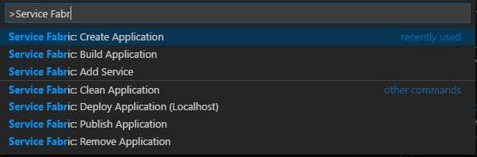
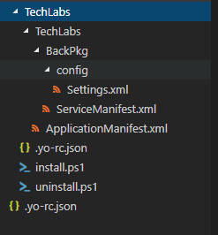
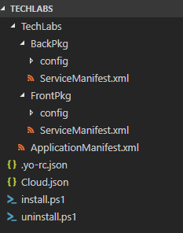
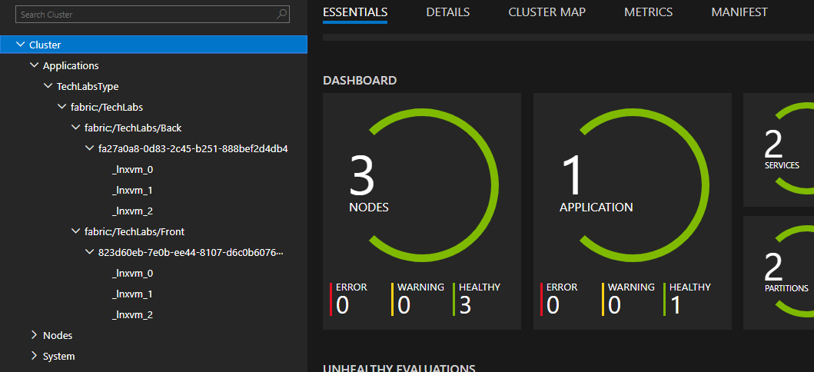

# Instructions

La liste des raccourcis VS Code est disponible pour [MacOS](https://code.visualstudio.com/shortcuts/keyboard-shortcuts-macos.pdf) ou [Windows](https://code.visualstudio.com/shortcuts/keyboard-shortcuts-windows.pdf).

## Récupérer la solution via Github

Nous utiliserons des images de containers déja publiées dans un registry public mais si vous êtes curieux, vous pouvez récupérer le code des containers d'application à cette addresse :

```bash
git clone https://github.com/SoatGroup/techlab-servicefabric-containers.git
```

## Initialiser la solution

Créer un nouveau dossier, et ouvrir celui-ci dans VS Code.

### Générer l'application Service Fabric

Lancer la commande  **Service Fabric : Create Application**



Renseignez les paramètres suivants : 
* Application Template : **azuresfcontainer**
* Name of your application : **Techlabs**
* Name of the application service : **Back**
* Input of the image name : **wilfriedwoivre/demo-servicefabric-back**
* Commands : 
* Number of instances of guest container application : **-1**
* Enter the container host mapping in the following format, container_port:host_port or press enter if not needed: **8080:8080**



<span style="color:red">**Ouvrez maintenant un nouveau Visual Studio Code sur le dossier TechLabs (le premier)**</span>

Il est possible de faire cela via le terminal intégré et la commande suivante :

```bash
code .\TechLabs\
```

### Ajouter le service Front

Ajouter le service Front grâce à la commande **Service Fabric : Add Service**

Renseignez les paramètres suivants : 
* Application Template : **azuresfcontainer**
* AddService
* Name of the application service : **Front**
* Input of the image name : **wilfriedwoivre/demo-servicefabric-front**
* Commands : 
* Number of instances of guest container application : **-1**
* Enter the container host mapping in the following format, container_port:host_port or press enter if not needed: **8000:80**

### Mettre en place le DNS du service Back 
Dans le fichier **Techlabs/ApplicationManifest.xml**, ajouter le DNS pour le service Back comme ci-dessous : 

```xml
  <DefaultServices>
    <!-- ADD SERVICE DNS NAME -->
    <Service Name="Back" ServiceDnsName="pythonback">
      <StatelessService ServiceTypeName="BackType" InstanceCount="-1">
        <SingletonPartition/>
      </StatelessService>
    </Service>
    <Service Name="Front">
      <StatelessService ServiceTypeName="FrontType" InstanceCount="-1">
        <SingletonPartition/>
      </StatelessService>
    </Service>
  </DefaultServices>
```

### Renseigner le nom DNS du service Back dans les variables d'environnement du Front

Dans le Fichier **FrontPkg\ServiceManifest.xml**, ajouter la variable d'environnement : 

```xml
<CodePackage Name="code" Version="1.0.0">
      <EntryPoint>
         <ContainerHost>
            <ImageName>wilfriedwoivre/demo-servicefabric-front</ImageName>
            <Commands></Commands>
         </ContainerHost>
      </EntryPoint>
      <EnvironmentVariables>
      <!-- ADD ENVIRONMENT VARIABLE -->
        <EnvironmentVariable Name="Back_DNSName" Value="pythonback" />
      </EnvironmentVariables> 
   </CodePackage>
```

## Déployer l'application 

### Créer un party cluster

Comment créer un party cluster : [http://mfery.com/blog/start-service-fabric-with-party-cluster/](http://mfery.com/blog/start-service-fabric-with-party-cluster/)

Récapitulatif de la création : 

* Se rendre sur l'url [https://try.servicefabric.azure.com/](https://try.servicefabric.azure.com/)
* Créer un compte via Github (ou Facebook) et l'utiliser pour se connecter
* Créer un cluster **Linux**
* Télécharger le PFX
* Installer le PFX via la commande Powershell dans le répertoire ou se trouve le PFX
```powershell
$cert = Import-PfxCertificate -FilePath .\party-cluster-XXXXXXX-client-cert.pfx -CertStoreLocation Cert:\CurrentUser\My -Password (ConvertTo-SecureString 1234567890 -AsPlainText -Force)
$cert.Thumbprint | Clip
```
Lorsque vous jouerez cette commande, le thumbprint sera ajouté au presse-papiers.
Il vous sera nécessaire pour le déploiement et cela vous évitera de le chercher dans les détails des certificats.

Si toutefois, vous n'aviez pas noté le thumbprint, vous pourrez toujours le récupérer via le Manager de Certificat (command certmgr).

### Compiler l'application 

Utiliser la commande **Service Fabric: Build application** qui nous génère les fichiers **Cloud.json**, **install.ps1** et **uninstall.ps1**



### Configuration de déploiement

Le fichier Cloud.json contient la configuration de connexion à votre cluster.
Il faut donc y modifier le certificat, le endpoint et le port (**19000**).
```Js
{
    "ClusterConnectionParameters": {
        "ConnectionIPOrURL": "lnx34397l57kh8.westus.cloudapp.azure.com",
        "ConnectionPort": "19000",
        "ClientKey": "",
        "ClientCert": "",
        "ServerCertThumbprint": "84ACA5A5EC27FB486BA950DEF5744D0042745502",
        "ClientCertThumbprint": "84ACA5A5EC27FB486BA950DEF5744D0042745502"
    }
}
```

### Vérifier votre déploiement

*Le déploiement peut prendre quelques minutes*

Allez sur l'url [https://lnx34397l57kh8.westus.cloudapp.azure.com:19080/Explorer/index.html](https://lnx34397l57kh8.westus.cloudapp.azure.com:19080/Explorer/index.html) (en fonction de votre cluter) afin que votre déploiement soit similaire à celui-ci : 



Il est possible de voir le résultat de votre application sur le site : 
[http://lnx34397l57kh8.westus.cloudapp.azure.com](http://lnx34397l57kh8.westus.cloudapp.azure.com:8080) 
